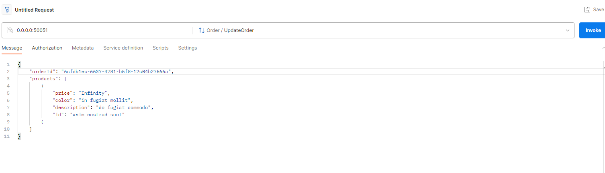
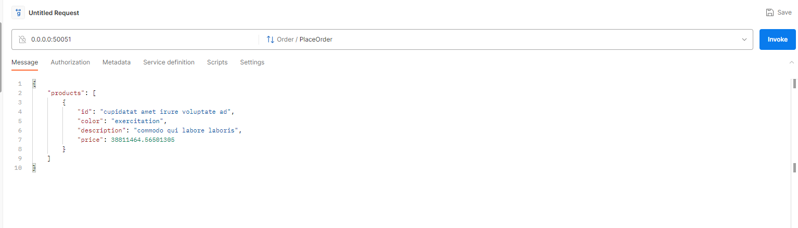

# RabbitMq GRPC NAGP Assignment

This project demonstrates a microservices architecture with services for Product, Order, and Notification using RabbitMq for communication.
https://github.com/shivambindal93/nagp-grpc-rabbitmq

## Table of Contents

- [Services](#services)
  - [Product Service](#product-service)
  - [Order Service](#order-service)
  - [Notification Service 1](#notification-service-1)
  - [Notification Service 2](#notification-service-2)
- [Getting Started](#getting-started)
  - [Prerequisites](#prerequisites)
  - [Installation](#installation)
- [Configuration](#configuration)
- [Usage](#usage)
  - [Place Order](#place-order)
  - [Update Order](#update-order)

## Introduction

This project showcases a microservices architecture where the Product Service communicates with the Order Service to place and update orders. Notification services listen for events and provide notifications.

## Services

### Product Service

The Product Service manages product-related operations, including placing and updating orders.

### Order Service

The Order Service handles order-related functionalities, including placing orders and updating orders. It also publishes events for order creation and updates.

### Notification Service 1

Notification Service 1 subscribes to order creation events and processes notifications.

### Notification Service 2

Notification Service 2 subscribes to both order creation and update events and processes notifications.

## Getting Started

### Prerequisites

- Node.js and npm
- RabbitMQ server
  (To start RabbitMQ on docker you can refer https://www.architect.io/blog/2021-01-19/rabbitmq-docker-tutorial/ it bears the docker command to pull RabbitMq Image with Management Plugin and start the same)
  Docker commands used are
  - docker pull rabbitmq:3-management
  - docker run --rm -it -p 15672:15672 -p 5672:5672 rabbitmq:3-management

### Installation

1. Clone the repository:
2. Install dependencies for each service:

   # Product Service

   cd product-service
   npm install

   # Order Service

   cd order-service
   npm install

   # Notification Service 1

   cd notification-service1
   npm install

   # Notification Service 2

   cd notification-service2
   npm install

### Configuration

Update the RabbitMQ configuration URLs in the rabbitmq-config directory for each service or update the PORT, RABBITMQ_URL, ORDER_SERVICE_URL in dev.env file.

### Usage

Start each service using the following command:

# Product Service

cd product-service
npm start

# Order Service

cd order-service
npm start

# Notification Service 1

cd notification-service1
npm start

# Notification Service 2

cd notification-service2
npm start

## Place Order

To place an order, make a gRPC call to the Product Service:

# Example Place Order Request

      grpcurl -plaintext -d '{"id": "1", "color": "blue", "description": "Sample Order", "price": 49.99}' localhost:50051 order.Order/PlaceOrder

or use Postman to hit a grpc request and order.proto file (nagp_assignment\product-service\protos\order.proto)

## Update Order

To update an order, make a gRPC call to the Product Service:

# Example Update Order Request

      grpcurl -plaintext -d '{"id": "1", "color": "red", "description": "Updated Order", "price": 59.99}' localhost:50051 order.Order/UpdateOrder

or use Postman to hit a grpc request and order.proto file (nagp_assignment\product-service\protos\order.proto)

